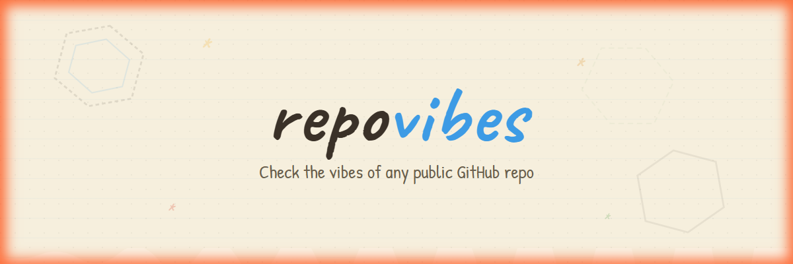
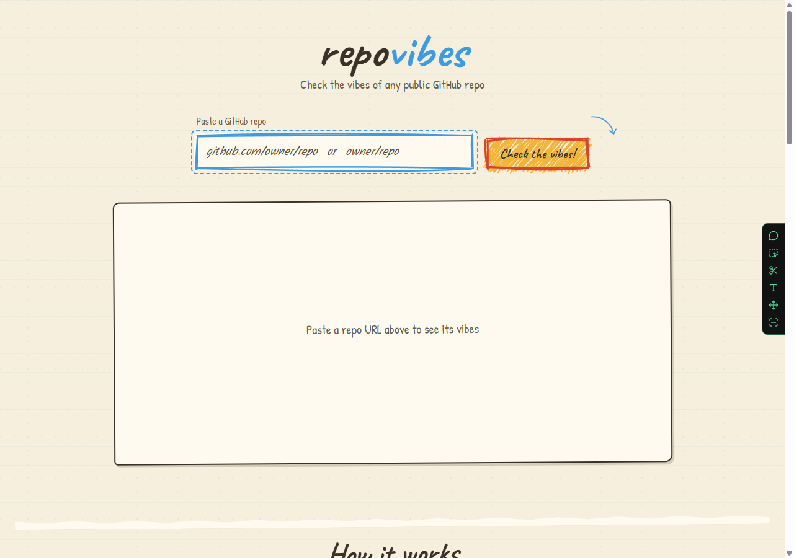
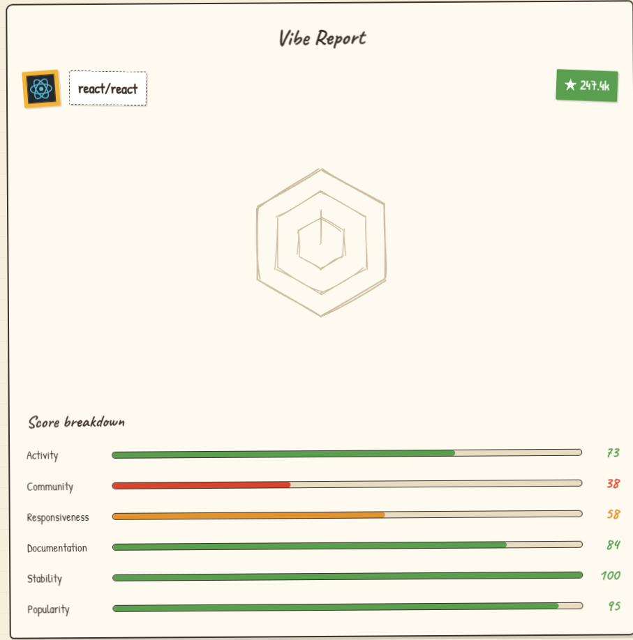
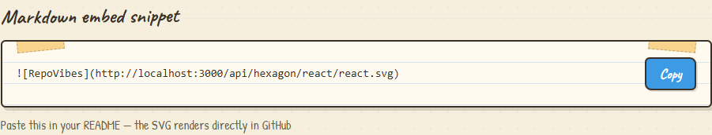

<div align="center">



[](https://repovibes.vercel.app)
[](https://react.dev)
[](https://vitejs.dev)
[](https://expressjs.com)

[](LICENSE)
[](https://github.com/Terminay/repovibes/stargazers)
[](https://github.com/Terminay/repovibes/commits)

</div>

---

## Table of Contents

- [Overview](#overview)
- [Features](#features)
- [Tech Stack](#tech-stack)
- [Gallery](#gallery)
- [Getting Started](#getting-started)
- [Usage](#usage)
- [Embeddable Badge](#embeddable-badge)
- [The Six Vibes](#the-six-vibes)
- [Contributing](#contributing)
- [License](#license)

---

## Overview

> "Your README is the first thing people see -- give it some vibes."

**RepoVibes** is a web tool that analyzes any public GitHub repository and distills its health into a single, hand-drawn hexagon chart. Think of it as a vibe check for your code.

Paste a repo URL, and RepoVibes fetches public data from the GitHub API -- commit history, issue management, community contributions, releases, and more -- then scores the repo across **six axes** of project health. The result is a sketchy, crayon-and-paper style hexagon chart you can embed directly into your README.

No login. No setup. Just vibes.

---

## Features

| Feature | Description |
|---------|-------------|
| **Crayon-Paper Aesthetic** | Hand-drawn SVG borders, rough.js sketch effects, torn-paper dividers, and a warm cream palette that feels like a fresh notebook page. |
| **Hexagon Vibe Chart** | A unique six-axis radar chart rendered with animated draw-in effects -- each axis represents a different health metric. |
| **Embeddable SVG Badge** | Generate a self-contained SVG badge that updates dynamically. Drop one line of Markdown into your README and you're done. |
| **Real-Time Analysis** | Fetches live data from the GitHub API -- no stale snapshots. |
| **Score Breakdown Bars** | A compact bar-chart view of all six scores, color-coded by performance tier. |
| **Accessibility First** | Proper heading hierarchy, visible focus rings, `prefers-reduced-motion` support, and WCAG AA contrast ratios. |
| **Responsive Design** | Looks great on desktop, tablet, and mobile with adaptive layouts. |
| **Hand-Drawn UI Elements** | Every border, button, and card is sketched -- no sharp corporate corners here. |

---

## Tech Stack

<div align="center">

| Layer | Technology | Purpose |
|:-----:|:----------:|:--------|
| Frontend | [React 18](https://react.dev) | UI components & state management |
| Build Tool | [Vite 5](https://vitejs.dev) | Lightning-fast dev server & bundling |
| Styling | Vanilla CSS + Custom Tokens | Crayon-paper design system with CSS variables |
| Graphics | [Rough.js](https://roughjs.com) | Hand-drawn SVG primitives & sketchy borders |
| Backend | [Express.js](https://expressjs.com) | API proxy for GitHub data & SVG generation |
| Screenshot | Puppeteer | Automated screenshot capture for embed previews |

</div>

### Design Tokens

```css
/* The crayon palette */
--paper:        #f6efdd;   /* Warm cream background  */
--paper-2:      #fffaf0;   /* Off-white card surface */
--ink:          #3a3128;   /* Dark brown text        */
--crayon-red:   #d8452f;   /* Error / low scores     */
--crayon-blue:  #3d9be5;   /* Accent / links         */
--crayon-yellow:#f2b53a;   /* Highlights             */
--crayon-green: #5a9e4f;   /* Success / high scores  */
--crayon-orange:#e0932f;   /* Warning / mid scores   */
```

---

## Gallery

> Screenshots of the live application at [repovibes.vercel.app](https://repovibes.vercel.app)

### Landing Page

The homepage greets you with a sketchy input form, hand-drawn borders, and that unmistakable notebook-paper texture.



### Vibe Report Card

After analyzing a repo, you get a cohesive **Vibe Report** -- sticky-note header, animated hexagon chart, and a color-coded score breakdown.



### README Embed Preview

See exactly how your embed will look inside a GitHub README before you copy the snippet.



---

## Getting Started

### Prerequisites

- [Node.js](https://nodejs.org/) >= 18
- [npm](https://www.npmjs.com/) or [pnpm](https://pnpm.io/)

### Installation

```bash
# 1. Clone the repository
git clone https://github.com/Terminay/repovibes.git
cd repovibes

# 2. Install dependencies
npm install

# 3. Start the development server
#    This starts both the Express backend (port 3001)
#    and the Vite frontend (port 3000) concurrently.
npm run dev
```

### Open in Browser

| Service | URL |
|:--------|:----|
| Frontend | [http://localhost:3000](http://localhost:3000) |
| Backend API | [http://localhost:3001](http://localhost:3001) |

---

## Usage

### Analyzing a Repository

1. Go to [repovibes.vercel.app](https://repovibes.vercel.app) (or your local `localhost:3000`)
2. Paste a GitHub repo URL or shorthand:
   - Full URL: `https://github.com/facebook/react`
   - Shorthand: `facebook/react`
3. Click **"Check the vibes!"**
4. Watch the scribble-loader draw itself while we fetch the data
5. Get your **Vibe Report** with the hexagon chart and score breakdown

### Available Scripts

```bash
# Development -- starts both backend & frontend
npm run dev

# Production build -- bundles the React frontend
npm run build

# Production server -- serves the built frontend
npm start
```

---

## Embeddable Badge

> The killer feature: a dynamic SVG badge that lives in your README.

Every repo analyzed gets a unique, auto-updating SVG embed. Just copy the Markdown snippet and paste it into your `README.md`:

```markdown

```

### Live Examples

| Repository | Embed Code | Preview |
|:-----------|:-----------|:--------|
| `facebook/react` | `` |  |
| `vercel/next.js` | `` |  |
| `microsoft/vscode` | `` |  |

> **Tip:** The badge updates automatically on every page load -- no caching headaches.

---

## The Six Vibes

RepoVibes evaluates repositories on six honest little *vibe-o-meters*:

| Vibe | What It Measures |
|:-----|:-----------------|
| **Activity** | How recently and how often code gets pushed. |
| **Community** | The number of different people contributing to the project. |
| **Responsiveness** | How well maintainers keep up with and close issues. |
| **Documentation** | The presence and depth of README, license, description, and topics. |
| **Stability** | The use of tagged releases and how fresh the latest one is. |
| **Popularity** | Stars and forks, adjusted for repo age to measure growth. |

### Score Colors

```
70-100  High vibe    -- This repo is thriving!
40-69   Mid vibe     -- Room for improvement.
0-39    Low vibe     -- Could use some love.
```

---

## Contributing

> Got an idea? Found a bug? We'd love your help.

1. **Fork** the repository
2. **Clone** your fork: `git clone https://github.com/YOUR_USERNAME/repovibes.git`
3. **Create a branch**: `git checkout -b feature/amazing-thing`
4. **Make your changes** -- keep the crayon spirit alive
5. **Commit**: `git commit -m "feat: add amazing thing"`
6. **Push**: `git push origin feature/amazing-thing`
7. **Open a Pull Request**

### Design Guidelines

If you're contributing UI changes, please respect the **crayon-paper** aesthetic:

- Use the design tokens in `src/index.css` -- no hardcoded colors.
- Borders should feel hand-drawn (rough.js or irregular border-radius).
- Shadows are hard-offset, not blurred (`3px 4px 0 rgba(58,49,40,0.18)`).
- Fonts: Caveat (headings), Kalam (body), Patrick Hand (labels).
- Animations should be playful but respect `prefers-reduced-motion`.

---

## License

This project is open source and available under the [MIT License](LICENSE).

---

<div align="center">

### Made with crayons & caffeine

*Scores are heuristic vibes, not official metrics.*

[](https://github.com/Terminay/repovibes)

</div>
